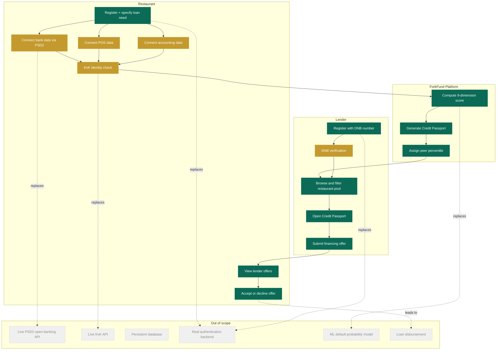

# ForkFund

**The credit passport for restaurant finance.**

ForkFund is a B2B fintech platform that turns fragmented restaurant data into a standardised, lender-ready Credit Passport. Restaurants connect their bank, POS, and accounting data to receive an explainable 0-100 score and attract financing offers from professional lenders. Lenders use ForkFund to screen restaurant borrowers faster, filter by grade and loan size, and submit offers directly through the platform.

Built as an academic MVP for RSM FinTech: Business Models and Applications (2026). All data is synthetic.

---

## Quick start

```bash
git clone https://github.com/erenibrahimof-cmd/forkfund-mvp.git
cd forkfund-mvp
python3 -m venv .venv
source .venv/bin/activate        # Windows: .venv\Scripts\activate
pip install -r requirements.txt
streamlit run app_new_login.py
```

The app opens at `http://localhost:8501`.

### Demo accounts

| Role | Email | Password |
|---|---|---|
| Restaurant | `restaurant@forkfund.io` | `demo1234` |
| Lender | `lender@forkfund.io` | `demo1234` |

---

## What is built

### Restaurant side
- Register and specify financing need (loan amount, purpose, city, cuisine type)
- Connect data sources: bank (PSD2), POS, accounting — each raises the data completeness score
- Receive a real-time Credit Passport: 0-100 score, A-E grade, written risk drivers, peer percentile
- View lender offers: amount, rate, term, loan type, conditions, and lender message
- Respond to offers: express interest or decline

### Lender side
- Register with institution details and DNB registration number
- Browse a filtered pool of 80 restaurant profiles (by city, grade, loan size, loan purpose)
- Open any restaurant's full Credit Passport: score breakdown, trends, data sources
- Submit a financing offer: amount, rate, term, conditions, message to restaurant
- Offer appears immediately in the restaurant's "My Lender Offers" page

### Two-sided flow
The app demonstrates the full marketplace loop: restaurant registers and connects data, Credit Passport is generated, lender filters and views the profile, lender submits an offer, restaurant sees and responds to the offer.

---

## Architecture

```
forkfund-mvp/
├── app_new_login.py       # Main Streamlit app
│                          # Login/register, role routing, all page renderers
├── src/
│   ├── data_loader.py     # CSV ingestion, validation, derived metric computation
│   └── scorer.py          # 9-dimension rules-based scoring engine
├── data/
│   ├── restaurants.csv    # 80 synthetic restaurant profiles
│   ├── monthly_bank.csv   # 12 months of bank data per restaurant
│   ├── monthly_pos.csv    # 12 months of POS data per restaurant
│   ├── accounting.csv     # Annual financial summary per restaurant
│   └── lenders.csv        # 8 synthetic lender profiles
├── docs/
│   ├── mvp_design.md      # Full MVP specification (authoritative source)
│   └── data_schema.md     # CSV field definitions
├── scripts/
│   └── generate_synthetic_data.py  # Synthetic data generator (fixed seed)
├── CLAUDE.md              # AI agent instructions
├── AGENTS.md              # Agent orchestration reference
└── requirements.txt
```

### Data flow

```
CSV files (data/)
    |
src/data_loader.py
Loads, validates, and computes derived metrics at runtime
(prime cost ratio, DSCR proxy, revenue CV, rent-to-revenue, etc.)
    |
src/scorer.py
9-dimension rules-based scoring engine
Produces: score (0-100), grade (A-E), risk label, written drivers, peer percentile
    |
app_new_login.py
Streamlit UI: login gate, role-based routing, page renderers
Lender offers stored in session state and surfaced to restaurant in real time
```

No scores or derived metrics are stored in the CSV files. Everything is computed at runtime from the raw data on each page load.

---

## Scoring model

The ForkFund score is rules-based, deterministic, and explainable. It uses nine dimensions drawn from bank, POS, and accounting data:

| Dimension | Weight | Data source |
|---|---|---|
| Data completeness | 10% | All sources |
| Revenue stability | 15% | POS |
| Cash-flow strength | 15% | Bank |
| Debt burden and repayment capacity | 15% | Accounting |
| Prime cost efficiency | 10% | Accounting |
| Rent and occupancy pressure | 10% | Accounting |
| POS demand quality | 10% | POS |
| Seasonality and concentration risk | 10% | POS |
| Business maturity | 5% | KvK / registration date |

The score is a pre-underwriting support tool, not a final credit decision. It does not estimate default probability and is not a trained machine-learning model.

---

## Implemented vs not implemented

| Feature | Status | Notes |
|---|---|---|
| Restaurant registration and onboarding | Implemented | Session-based, no persistent storage |
| Data source connection (bank, POS, accounting) | Simulated | Toggle-based, feeds completeness score |
| 9-dimension rules-based scoring engine | Implemented | Deterministic, explainable, runtime computed |
| Credit Passport with score, grade, drivers | Implemented | Matches slide 5 of investor pitch deck |
| Peer percentile within revenue band | Implemented | Computed against 80-restaurant pool |
| Lender dashboard with filters | Implemented | City, grade, loan size, loan purpose |
| Lender offer submission | Implemented | Amount, rate, term, conditions, message |
| Restaurant offer response | Implemented | Accept interest or decline per offer |
| Role-based login and registration | Implemented | Session state, no real auth backend |
| DNB verification (lender) | Simulated | Animated verification screen |
| KvK verification (restaurant) | Simulated | Animated verification screen |
| Live PSD2 / open-banking connection | Not implemented | Simulated with synthetic bank CSV |
| Live KvK API | Not implemented | KvK numbers are synthetic |
| Persistent database | Not implemented | Session state only, resets on restart |
| Real authentication | Not implemented | Hardcoded demo credentials |
| Predictive ML default model | Not implemented | Out of scope by design |
| Money movement or loan disbursement | Not implemented | Out of scope by design |

### Business process flowchart

The diagram below maps the end-to-end ForkFund marketplace process and shows which steps are built, simulated, or out of scope.



**Legend:** green = implemented, gold = simulated in MVP, gray dashed = out of scope

---

## AI agent workflow

This project was built using **Claude** (claude.ai) as the primary coding assistant, with **Claude Code** used for agentic file editing and iteration.

### Orchestration approach

**Design-doc-first:** Before writing any code, a full MVP specification was written in `docs/mvp_design.md`. This document covers scoring dimensions, formulas, grade bands, data schema, and page layout and served as the authoritative source of truth for all code generation. `CLAUDE.md` summarises this spec for the agent context.

**Step-by-step approval gates:** The `CLAUDE.md` development approach required proposing a plan before each component and waiting for human approval. Components were built in sequence: skeleton, synthetic data, data loader, scoring engine, UI pages, login and role system, offer flow, documentation.

**Why Claude:** Claude was chosen for its ability to reason through complex multi-part architecture (two-sided marketplace, session state routing, role-based UI) and maintain consistency across a large codebase across many editing sessions.

**Human decisions retained:** All product decisions were made by the team: which features to build, what the UX flow should be, which demo restaurant to use, how to handle lender verification. Claude generated code from those decisions. All generated code was reviewed and tested before committing.

---

## Synthetic data

All restaurant, bank, POS, accounting, and lender data is synthetic. Generated using `scripts/generate_synthetic_data.py` with a fixed random seed for reproducibility.

- 80 restaurant profiles across Amsterdam, Rotterdam, Utrecht, The Hague, Eindhoven, Groningen
- 4 revenue bands: EUR 150k-500k, EUR 500k-1M, EUR 1M-1.5M, EUR 1.5M+
- 3 pinned demo restaurants: Bonne Table (Grade A), Trattoria Pietro (Grade C), Levant Express (Grade D)
- 12 months of bank and POS data per restaurant
- 8 synthetic lender profiles

The demo restaurant used in the registration flow is **Trattoria Pietro** (Rotterdam, Grade C, score 65.4): a mid-range profile with clear strengths and improvement areas, suited to demonstrate the full scoring narrative.

---

## Requirements

- Python 3.10+
- See `requirements.txt` for the full dependency list (Streamlit, Pandas, NumPy)

---

## License

MIT License. See `LICENSE` for details.

Academic project, RSM Erasmus University, FinTech: Business Models and Applications, 2026.
Team: Eren Ibrahimof Berke (633021) / Sarah Laik (654939)
